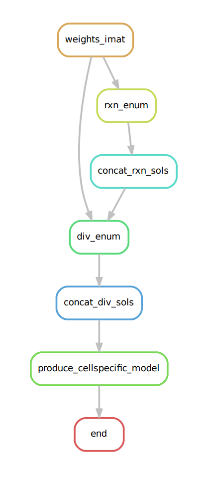

# OCMMED
Obtaining cell-specific metabolic models through enumeration with DEXOM

## Requirements
- Python 3.7 - 3.9
- cplex 12.10 - 22.10
- python packages in the `requirements.txt` file

## Installation
The repository can be cloned with `git clone https://forgemia.inra.fr/metexplore/cbm/ocmmed.git` and installed with `python setup.py install`

For the installation of the cluster pipeline, see [cluster instructions file](cluster_instructions.md).

For installing CPLEX on your own computer, detailed instructions are given in the dexom-python package: https://pypi.org/project/dexom-python/  

## Parameters
The `parameters.yaml` file contains the main parameters, including the path to the metabolic model and the path to the gene expression file  
`params_additional.yaml` contains more optional parameters

## Input files
The main inputs are:  
- a metabolic network in SBML, json or matlab format
The model is imported using the cobrapy library.

- a csv file containing data which is used for constraining the model.
The expected default input is preprocessed RNA microarray data (see `pilot_data/gene_expression_meanvalues.csv` for an example of this input).  
By default, the pipeline will determine, for each column in the expression data, the genes with the highest and lowest expression. The algorithm will then determine the reactions associated to genes with high/low expression.  

Instead of expression data, you can provide a file with gene scores, in the same format as the example expression file. You can for example provide a file in which highly expressed genes have a score of 1 and lowly expressed genes a score of -1. Don't forget to set the parameter `qualitative: false` in order to map genes scores directly to the reactions.

You can also directly provide precalculated reaction scores. In this case, set `reaction_scores: true`. The resulting networks will maximize active reactions with positive scores and inactive reactions with negative scores.

## Main pipeline
First, the gene expression data (if provided) is converted into one set of reaction weights for each experimental condition.  
These weights are then used to find a context-specific network which maximizes the active reactions with positive weights and inactive reactions with negative weights.  
Afterwards, DEXOM is used to enumerate multiple solutions (reaction-enumeration & diversity-enumeration)  
The DEXOM solutions are merged and used to construct the new metabolic model which is saved as an SBML file.

## Cluster pipeline
Because the enumeration of multiple solutions with DEXOM can be very slow when using large metabolic networks and/or large transcriptomic datasets, the pipeline has been adapted for use on computation clusters with the snakemake workflow managment tool.  
Parameters for the cluster pipeline can be found in `params_cluster.yaml`  

Pictured below is the snakemake rulegraph representation of the "separate" workflow.  
Refer to the [cluster instructions file](cluster_instructions.md) for a detailed explanation.  

